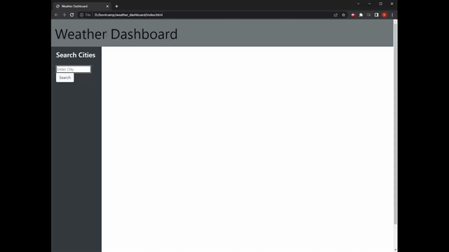

# Weather Dashboard
This application is a weather dashboard which allows a user to search for a specified city and get the current weather information as well as a the future five day forecast.

## Project Description
To use this application, simply type in the desired city name in the input form on the left sidebar and press the search button. If the city typed in does not exist then a coordinate will not be fetched and no weather information of that city will be displayed. All previous searches which return a valid response will be added to the side as buttons that the user can quickly press to get the weather data. These previously searched city buttons will persist as their data is stored in local storage.
When looking for the current weather information for a city, the current temperature, wind speed, and humidity are given. In the 5 day forecast, the weather information for the next 5 days are displayed. These information include the daily low and high temperatures as well as the average windspeeds and humidity. Each weather card also includes an icon which corresponds to the days' weather conditions.

 

## Deployment
This webpage is deployed through github pages:
https://dempleon.github.io/weather_dashboard/

## Dev Notes
This application use the Open Weather Api to fetch the geolocation of the desired city. By using the latitude and longitude of the city the current day weather, and the future five day forecast can be fetched from the api. This application also uses bootstrap, jquery, and moment.js. The information for the current day and five day forecasts are dynamically created by javascript. All previously searched cities are stored into the local storage so that when the page reloads, they will be visible to the side.
